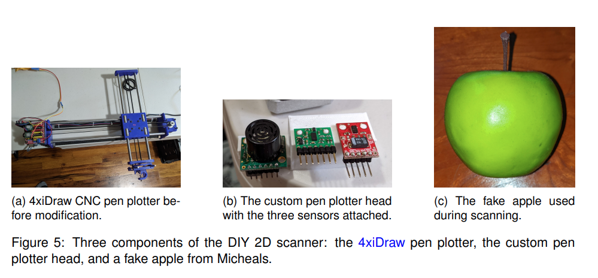
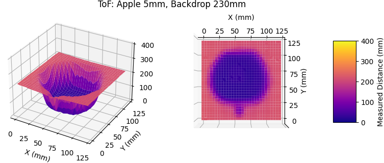
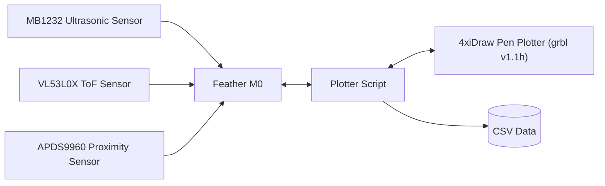

# Applevision ToF Profiler

This repository contains all of the code/models required to create the distance sensor characterization setup used by the Apple Vision capstone project. More information on this setup and it's findings can be found in the handoff document TODO.

## Repository Structure

This repository splits components of the testing rig into subfolders:
* [`data/`](data/) - Raw CSV data of the apple scans. See the [format document](./data/format.md) for more information.
* [`models/`](models/) - CAD model of the custom pen plotter head in various formats. Originally designed in Autodesk Fusion 360.
* [`plotter_firmware/`](plotter_firmware/) - PlatformIO firmware for a [Feather M0](https://www.adafruit.com/product/2772) to relay sensor readings from the plotter head to the computer.
* [`plotter_script/`](plotter_script/) - Python script which controls the pen plotter and collects data from the sensors.
* [`scripts/`](scripts/) - Scripts to visualize, model, and animate the data collected.
