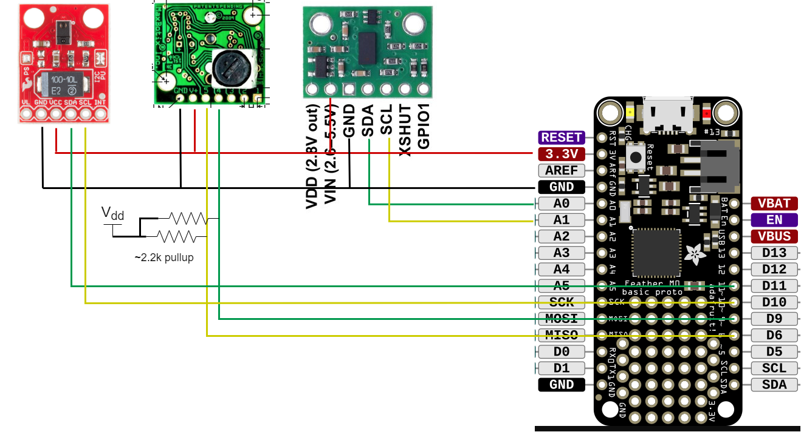

# Plotter Head Firmware

This folder contains a [PlatformIO](https://platformio.org/) project for firmware on a [Feather M0](https://www.adafruit.com/product/2772) which reads three distance sensors and relays the data through a serial port. Sensors are mounted to the custom pen plotter head and wires are connected to the Feather as shown in the wiring diagram below.



Once connected, the Feather M0 will listen on the USB serial port for commands:
* `m`: Take a measurement and print out the result in JSON format.
* `r`: Print `ok` if initialized correctly.

An example of interaction while using this device (input from computer is shown using >):
```console
Init
Ready!
> m
{"lidar": 23, "intensity": 255, "ultra": 20}
> r
ok
```

## I2C

To prevent stupid electrical/driver issues with I2C, each sensor is given it's own I2C bus which it control with impunity. Since the Feather M0 only has one hardware I2C bus, software busses are used on regular GPIO pins. The [`lib`](lib) folder contains sensor drivers that were modified to use a software I2C driver instead of the default `Wire` library (which uses the hardware one).